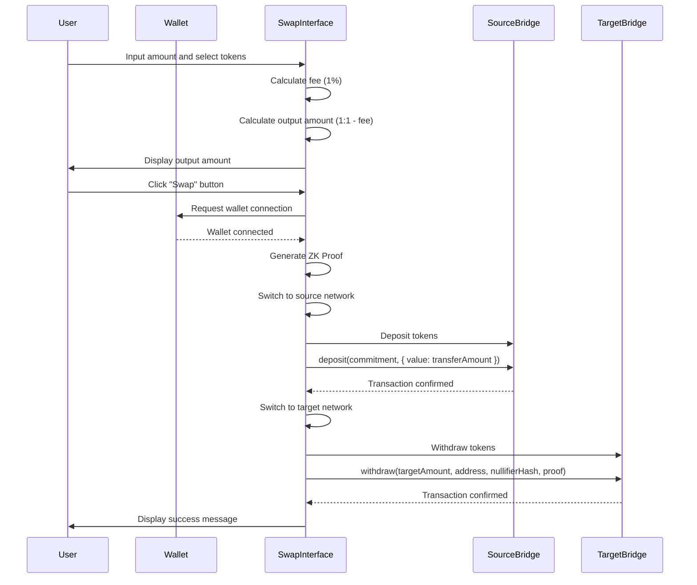

# NeoX - Cross-Chain Token Bridge

## Overview

NeoX is a decentralized application (dApp) that allows users to seamlessly swap tokens across multiple blockchains. With a focus on security and user experience, NeoX leverages Zero-Knowledge Proofs (ZKPs) to ensure that transactions are both private and verifiable.

## Supported Networks

NeoX now supports token swapping across **6 testnet networks**:

- **Mantle Sepolia** (Mantle Testnet)
- **Flow Testnet** (Flow EVM Testnet)
- **Ronin Testnet** (Saigon Testnet)
- **Flare Coston2** (Flare Testnet)
- **Saga Test** (Saga Testnet)
- **Saga Demo** (Saga Demo Network)

## Smart Contract Addresses

### Deployed Bridge Contracts

| Network | TestVerifier Contract | BridgeWithZKP Contract |
|---------|----------------------|------------------------|
| **Mantle Sepolia** | `0x836595601F67F7C2AA997d722DFb55886684d1C5` | `0x6Ba4f5b055C57BAd4C05eC0E45Ac078c5E59d9C9` |
| **Flow Testnet** | `0x836595601F67F7C2AA997d722DFb55886684d1C5` | `0x6Ba4f5b055C57BAd4C05eC0E45Ac078c5E59d9C9` |
| **Ronin Testnet** | `0x836595601F67F7C2AA997d722DFb55886684d1C5` | `0x6Ba4f5b055C57BAd4C05eC0E45Ac078c5E59d9C9` |
| **Flare Coston2** | `0x0DD6ca362B7Dd67750b17Ed8955F86E44f588f02` | `0x84078749748D24beE4F0159cC1c0Afe447415b5f` |
| **Saga Test** | `0x0DD6ca362B7Dd67750b17Ed8955F86E44f588f02` | `0x84078749748D24beE4F0159cC1c0Afe447415b5f` |
| **Saga Demo** | `0x0DD6ca362B7Dd67750b17Ed8955F86E44f588f02` | `0x84078749748D24beE4F0159cC1c0Afe447415b5f` |

*Note: Some contract addresses are the same across networks due to deterministic deployment.*

### Network Configuration

| Network | Chain ID | Native Token | RPC Endpoint |
|---------|----------|--------------|--------------|
| Mantle Sepolia | 5003 | MNT | `https://rpc.sepolia.mantle.xyz` |
| Flow Testnet | 545 | FLOW | `https://testnet.evm.nodes.onflow.org` |
| Ronin Testnet | 2021 | RON | `https://saigon-testnet.roninchain.com/rpc` |
| Flare Coston2 | 114 | C2FLR | `https://coston2-api.flare.network/ext/C/rpc` |
| Saga Test | 2751645467413000 | SAGA | `https://sagatest-2751645467413000-1.jsonrpc.sagarpc.io` |
| Saga Demo | 2751645565611000 | SAGAD | `https://sagademo-2751645565611000-1.jsonrpc.sagarpc.io` |

## Features

- **Cross-Chain Swapping**: Easily swap tokens between 4 supported testnet blockchains.
- **Zero-Knowledge Proofs**: Enhanced privacy and security for transactions.
- **1:1 Token Conversion**: Simplified cross-chain swaps with 1% bridge fee.
- **Staking**: Earn up to 12% APY by staking your tokens (coming soon).
- **User-Friendly Interface**: Intuitive design for a smooth user experience.

## Technologies Used

- **React**: Frontend framework for building the user interface.
- **Zero-Knowledge Proofs (ZKPs)**: A cryptographic method used to enhance privacy and security in transactions. ZKPs allow one party to prove to another that a statement is true without revealing any additional information. In NeoX, ZKPs are used to ensure that token swaps are secure and private.
- **Ethers.js v6**: Library for interacting with Ethereum-compatible blockchains.
- **Styled Components**: For styling React components.
- **Hardhat 2.25.0**: Development environment for Ethereum smart contracts.

## Getting Started

### Prerequisites

- Node.js (v18 or higher)
- npm (Node Package Manager)

### Installation

1. Clone the repository:

```bash
git clone https://github.com/yourusername/neox.git
cd neox
```

2. Install the dependencies:

```bash
npm install --legacy-peer-deps
```

3. Set up your environment variables:

Create a `.env` file in the root directory and add the following:

```plaintext
PRIVATE_KEY=your_private_key

# Bridge Contract Addresses
REACT_APP_MANTLE_SEPOLIA_VERIFIER_ADDRESS=0x836595601F67F7C2AA997d722DFb55886684d1C5
REACT_APP_MANTLE_SEPOLIA_BRIDGE_ADDRESS=0x6Ba4f5b055C57BAd4C05eC0E45Ac078c5E59d9C9
REACT_APP_FLOW_TESTNET_VERIFIER_ADDRESS=0x836595601F67F7C2AA997d722DFb55886684d1C5
REACT_APP_FLOW_TESTNET_BRIDGE_ADDRESS=0x6Ba4f5b055C57BAd4C05eC0E45Ac078c5E59d9C9
REACT_APP_RONIN_TESTNET_VERIFIER_ADDRESS=0x836595601F67F7C2AA997d722DFb55886684d1C5
REACT_APP_RONIN_TESTNET_BRIDGE_ADDRESS=0x6Ba4f5b055C57BAd4C05eC0E45Ac078c5E59d9C9
REACT_APP_FLARE_TESTNET_VERIFIER_ADDRESS=your_flare_verifier_address
REACT_APP_FLARE_TESTNET_BRIDGE_ADDRESS=your_flare_bridge_address
```

### Running the Application

1. Start the development server:

```bash
npm start
```

2. Open your browser and navigate to `http://localhost:3000` or `https://neox.thedrop.top`

## 🚨 Important Information 🚨

**When testing the bridge and swapping tokens, please make sure that the contract bridge has enough balance to cover the transaction amount, otherwise you will get an error alert and failing transaction.**

**The bridge now uses 1:1 token conversion with a 1% bridge fee for simplified cross-chain swaps.**

## Usage

1. Connect your wallet (e.g., MetaMask).
2. Select the source and destination networks.
3. Enter the amount you wish to swap.
4. Review the bridge fee (1% of the swap amount).
5. Click on the "Swap" button to initiate the transaction.
6. Optionally, explore the staking feature (coming soon).

## Testing

To run tests, use the following command:

```bash
npx hardhat test
```

## Deployment

### Deploy to All Networks

To deploy contracts to all supported networks:

```bash
node scripts/deploy-all-networks.js
```

### Deploy to Specific Networks

```bash
npx hardhat run scripts/deploy-multichain.js --network mantle-sepolia
npx hardhat run scripts/deploy-multichain.js --network flow-testnet
npx hardhat run scripts/deploy-multichain.js --network ronin-testnet
npx hardhat run scripts/deploy-multichain.js --network flare-coston2
```

## Contributing

Contributions are welcome! Please follow these steps:

1. Fork the repository.
2. Create a new branch (`git checkout -b feature/YourFeature`).
3. Make your changes and commit them (`git commit -m 'Add some feature'`).
4. Push to the branch (`git push origin feature/YourFeature`).
5. Open a pull request.

# Token Swap Process

This section describes the process of swapping tokens between different chains using our application.

## Sequence Diagram


## Roadmap 🗺️

1. **Cross-Chain Integration** : Add support for additional blockchains to broaden token swapping capabilities.
2. **Enhanced Staking Features**: Introduce new staking options and yield farming opportunities to incentivize user engagement and liquidity provision.
3. **Educational Initiatives** : Create tutorials and guides to help users understand how to use the platform and the benefits of using ZKPs in DeFi.
4. **Partnerships with DeFi Projects** : Collaborate with other DeFi projects to create synergies and enhance the platform's offerings.

## Business model 📈

- **Staking Rewards** : Users can provide liquidity to the bridge by staking their tokens in the bridge, thus they can earn rewards every time a transaction is made. The rewards are made from the transaction fees.
- **Transaction Fees** : Users pay a 1% fee for each cross-chain transaction made through the bridge.

## License

This project is licensed under the MIT License - see the [LICENSE](LICENSE) file for details.

