# ZKBridge - Cross-Chain Token Bridge

## Overview

ZKBridge is a decentralized application (dApp) that allows users to seamlessly swap tokens across multiple blockchains. With a focus on security and user experience, ZKBridge leverages Zero-Knowledge Proofs (ZKPs) to ensure that transactions are both private and verifiable.

## Flow Diagram

Below is a simplified visualization of the cross-chain bridge process:

```mermaid
sequenceDiagram
    autonumber
    participant U as User
    participant S as Source Chain
    participant V as ZKP Verifier
    participant T as Target Chain

    Note over U,T: 🔄 Cross-Chain Bridge Process

    %% Deposit Phase
    rect rgb(230, 240, 255)
        Note over U,T: 1️⃣ Deposit Phase
        U->>S: Initiate deposit
        Note right of U: Generate ZKP commitment
        S->>S: Verify & lock tokens
        S-->>U: Confirm deposit
    end

    %% Verification Phase
    rect rgb(255, 240, 230)
        Note over U,T: 2️⃣ Verification Phase
        U->>V: Request ZKP generation
        Note right of U: Prove ownership
        V-->>U: Return proof & nullifier
    end

    %% Withdrawal Phase
    rect rgb(230, 255, 240)
        Note over U,T: 3️⃣ Withdrawal Phase
        U->>T: Submit withdrawal request
        Note right of T: Verify proof & check nullifier
        T->>T: Process withdrawal
        T-->>U: Release tokens
    end

    %% Bridge Features
    rect rgb(240, 240, 255)
        Note over U,T: 🌟 Bridge Features
        Note over S,T: • 1% Bridge Fee<br/>• 12% APY Staking<br/>• Zero-Knowledge Privacy<br/>• Cross-Chain Security
    end
```



The bridge operates in three main phases:

1. **Deposit Phase** 🔒
   - User initiates a deposit on the source chain
   - System generates a ZKP commitment
   - Source chain locks the tokens

2. **Verification Phase** 🔐
   - ZKP verifier generates proof of ownership
   - Process maintains user privacy
   - Nullifier prevents double-spending

3. **Withdrawal Phase** 💫
   - User submits proof to target chain
   - System verifies proof authenticity
   - Target chain releases tokens

## Environment Setup

Create a `.env` file in the project root with the following configuration:

```env
# Network RPC URLs
MANTLE_SEPOLIA_RPC_URL=https://rpc.sepolia.mantle.xyz
FLOW_TESTNET_RPC_URL=https://testnet.evm.nodes.onflow.org
RONIN_TESTNET_RPC_URL=https://saigon-testnet.roninchain.com/rpc
FLARE_COSTON2_RPC_URL=https://coston2-api.flare.network/ext/C/rpc
SAGA_TEST_RPC_URL=https://sagatest-2751645467413000-1.jsonrpc.sagarpc.io
SAGA_DEMO_RPC_URL=https://sagademo-2751645565611000-1.jsonrpc.sagarpc.io

# Chain IDs
MANTLE_SEPOLIA_CHAIN_ID=5003
FLOW_TESTNET_CHAIN_ID=545
RONIN_TESTNET_CHAIN_ID=2021
FLARE_COSTON2_CHAIN_ID=114
SAGA_TEST_CHAIN_ID=2751645467413000
SAGA_DEMO_CHAIN_ID=2751645565611000

# Contract Addresses - TestVerifier
MANTLE_SEPOLIA_VERIFIER_ADDRESS=0x0DD6ca362B7Dd67750b17Ed8955F86E44f588f02
FLOW_TESTNET_VERIFIER_ADDRESS=0x5933761F56C00688405347Bb5e327B296FCE25E4
RONIN_TESTNET_VERIFIER_ADDRESS=0x485DDf8cFDE358Fa400999d27397bAa527715b66
FLARE_COSTON2_VERIFIER_ADDRESS=0x67A5fbfaa81e4f27863C923c135b7537a502E61B
SAGA_TEST_VERIFIER_ADDRESS=0xdff73b3629aeE76A77DDf575aeF5cd9D21de1217
SAGA_DEMO_VERIFIER_ADDRESS=0x42fEB86470b4118224f79AF2d82C22c7EDFC750c

# Contract Addresses - BridgeWithZKP
MANTLE_SEPOLIA_BRIDGE_ADDRESS=0x84078749748D24beE4F0159cC1c0Afe447415b5f
FLOW_TESTNET_BRIDGE_ADDRESS=0xfa240B732d2F48DB535cec3780Edb9Cb6d36346A
RONIN_TESTNET_BRIDGE_ADDRESS=0x27993cc63d51eE82acfde8b1f05D3b731fE194AC
FLARE_COSTON2_BRIDGE_ADDRESS=0xf134e8E879BA507dc263EF45632761A5cb48D2e0
SAGA_TEST_BRIDGE_ADDRESS=0x836595601F67F7C2AA997d722DFb55886684d1C5
SAGA_DEMO_BRIDGE_ADDRESS=0xdff73b3629aeE76A77DDf575aeF5cd9D21de1217

# Your private key for deployment
PRIVATE_KEY=your_private_key_here
```

## Supported Networks

ZKBridge now supports token swapping across **6 testnet networks**:

- **Mantle Sepolia** (Mantle Testnet)
- **Flow Testnet** (Flow EVM Testnet)
- **Ronin Testnet** (Saigon Testnet)
- **Flare Coston2** (Flare Testnet)
- **Saga Test** (Saga Testnet)
- **Saga Demo** (Saga Demo Network)

## Smart Contract Addresses

### Deployed Bridge Contracts

| Network | TestVerifier Contract | BridgeWithZKP Contract |
|---------|----------------------|------------------------|
| **Mantle Sepolia** | `0x0DD6ca362B7Dd67750b17Ed8955F86E44f588f02` | `0x84078749748D24beE4F0159cC1c0Afe447415b5f` |
| **Flow Testnet** | `0x5933761F56C00688405347Bb5e327B296FCE25E4` | `0xfa240B732d2F48DB535cec3780Edb9Cb6d36346A` |
| **Ronin Testnet** | `0x485DDf8cFDE358Fa400999d27397bAa527715b66` | `0x27993cc63d51eE82acfde8b1f05D3b731fE194AC` |
| **Flare Coston2** | `0x67A5fbfaa81e4f27863C923c135b7537a502E61B` | `0xf134e8E879BA507dc263EF45632761A5cb48D2e0` |
| **SagaTest** | `0xdff73b3629aeE76A77DDf575aeF5cd9D21de1217` | `0x836595601F67F7C2AA997d722DFb55886684d1C5` |
| **SagaDemo** | `0x42fEB86470b4118224f79AF2d82C22c7EDFC750c` | `0xdff73b3629aeE76A77DDf575aeF5cd9D21de1217` |

### Network Information

#### Flow Testnet
- Chain ID: 545
- RPC URL: https://testnet.evm.nodes.onflow.org
- Explorer: https://testnet.flowdiver.io

#### Ronin Testnet
- Chain ID: 2021
- RPC URL: https://saigon-testnet.roninchain.com/rpc
- Explorer: https://saigon-explorer.roninchain.com
- Faucet: https://faucet.roninchain.com/

#### Flare Coston2
- Chain ID: 114
- RPC URL: https://coston2-api.flare.network/ext/C/rpc
- Explorer: https://coston2-explorer.flare.network
- Faucet: https://coston2-faucet.towolabs.com/

#### SagaTest
- Chain ID: 2751645467413000
- RPC URL: https://sagatest-2751645467413000-1.jsonrpc.sagarpc.io
- Explorer: https://sagatest-2751645467413000-1.jsonrpc.sagarpc.io

#### SagaDemo
- Chain ID: 2751645565611000
- RPC URL: https://sagademo-2751645565611000-1.jsonrpc.sagarpc.io
- Explorer: https://sagademo-2751645565611000-1.jsonrpc.sagarpc.io

## Features

- 🔒 Secure cross-chain transfers with ZK proofs
- 💱 Support for multiple networks
- 🌉 User-friendly bridge interface
- 💰 Staking functionality (coming soon)
- 🔄 Real-time price feeds via Supra Oracle

## Getting Started

1. Clone the repository
2. Install dependencies: `npm install`
3. Start the app: `SKIP_PREFLIGHT_CHECK=true npm start`
4. Connect your wallet and add the networks
5. Get testnet tokens from the respective faucets
6. Start bridging tokens across networks!

## Technologies Used

- **React**: Frontend framework for building the user interface.
- **Zero-Knowledge Proofs (ZKPs)**: A cryptographic method used to enhance privacy and security in transactions. ZKPs allow one party to prove to another that a statement is true without revealing any additional information. In ZKBridge, ZKPs are used to ensure that token swaps are secure and private.
- **Ethers.js v6**: Library for interacting with Ethereum-compatible blockchains.
- **Styled Components**: For styling React components.
- **Hardhat 2.25.0**: Development environment for Ethereum smart contracts.

## 🚨 Important Information 🚨

**When testing the bridge and swapping tokens, please make sure that the contract bridge has enough balance to cover the transaction amount, otherwise you will get an error alert and failing transaction.**

**The bridge now uses 1:1 token conversion with a 1% bridge fee for simplified cross-chain swaps.**

## Usage

1. Connect your wallet (e.g., MetaMask).
2. Select the source and destination networks.
3. Enter the amount you wish to swap.
4. Review the bridge fee (1% of the swap amount).
5. Click on the "Swap" button to initiate the transaction.
6. Optionally, explore the staking feature (coming soon).

## Testing

To run tests, use the following command:

```bash
npx hardhat test
```

## Deployment

### Deploy to All Networks

To deploy contracts to all supported networks:

```bash
node scripts/deploy-all-networks.js
```

### Deploy to Specific Networks

```bash
# Deploy to Mantle Sepolia
npx hardhat run scripts/deploy-multichain.js --network mantle-sepolia

# Deploy to Flow Testnet
npx hardhat run scripts/deploy-multichain.js --network flow-testnet

# Deploy to Ronin Testnet
npx hardhat run scripts/deploy-multichain.js --network ronin-testnet

# Deploy to Flare Coston2
npx hardhat run scripts/deploy-multichain.js --network flare-coston2

# Deploy to Saga Test
npx hardhat run scripts/deploy-multichain.js --network saga-test

# Deploy to Saga Demo
npx hardhat run scripts/deploy-multichain.js --network saga-demo
```

## Contributing

Contributions are welcome! Please follow these steps:

1. Fork the repository.
2. Create a new branch (`git checkout -b feature/YourFeature`).
3. Make your changes and commit them (`git commit -m 'Add some feature'`).
4. Push to the branch (`git push origin feature/YourFeature`).
5. Open a pull request.

# Token Swap Process

This section describes the process of swapping tokens between different chains using our application.

## Roadmap 🗺️

1. **Cross-Chain Integration** : Add support for additional blockchains to broaden token swapping capabilities.
2. **Enhanced Staking Features**: Introduce new staking options and yield farming opportunities to incentivize user engagement and liquidity provision.
3. **Educational Initiatives** : Create tutorials and guides to help users understand how to use the platform and the benefits of using ZKPs in DeFi.
4. **Partnerships with DeFi Projects** : Collaborate with other DeFi projects to create synergies and enhance the platform's offerings.

## Business model 📈

- **Staking Rewards** : Users can provide liquidity to the bridge by staking their tokens in the bridge, thus they can earn rewards every time a transaction is made. The rewards are made from the transaction fees.
- **Transaction Fees** : Users pay a 1% fee for each cross-chain transaction made through the bridge.

## License

This project is licensed under the MIT License - see the [LICENSE](LICENSE) file for details.

